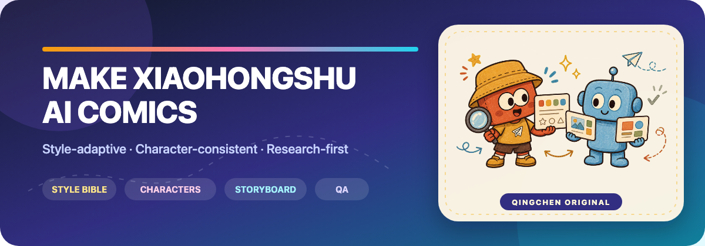
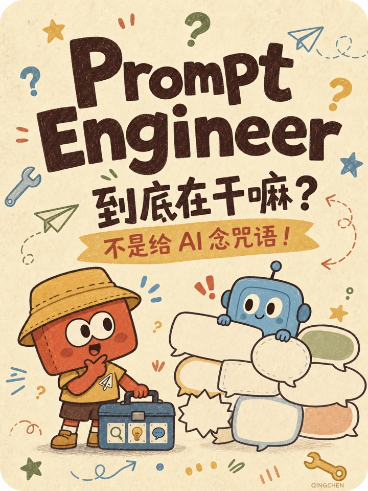

  

  
  
  
  

  <strong>Turn AI concepts into accurate, entertaining, character-consistent Xiaohongshu comics—in any visual style.</strong>

  Research → style bible → character bible → storyboard → image prompts → QA → publish package.

---

## What is this?

<strong>Make Xiaohongshu AI Comics</strong> is an open-source Codex Skill for producing swipeable AI knowledge comics. It standardizes the reasoning-heavy parts of the workflow while leaving the visual direction open to every creator.

It does not prescribe a house style, fixed palette, or bundled cast. The documentation includes creator-owned showcase artwork, but those assets are not used by the workflow or copied into new projects. Each project derives its own visual language from the user's prompt or reference images, then freezes that language in a project-specific style bible.

> 中文简介：这是一个风格自适应的 Codex Skill，用于把 AI 概念转化为适合小红书发布的漫画科普笔记。页面中的作品仅作为创作者案例展示，不会成为 Skill 的默认画风或角色；每个新项目都会重新建立自己的画风圣经、角色圣经、分镜、出图提示词和质量检查流程。

## Why use it?

| Capability | What it protects |
|---|---|
| 🎨 Style-adaptive workflow | Different creators can use watercolor, collage, pixel art, editorial illustration, or their own references |
| 🧬 Character continuity | Recurring characters keep their silhouette, proportions, colors, accessories, and teaching roles |
| 🔎 Research-first writing | Definitions, boundaries, misconceptions, and limitations are checked before the comic copy is written |
| 📱 Xiaohongshu-native structure | One idea per 3:4 page, strong swipe rhythm, short mobile-readable copy |
| 🧪 Page-by-page QA | Exact Chinese text, technical terms, visual drift, and semantic qualifiers are reviewed |
| 📦 Repeatable delivery | Pages, caption, sources, bibles, prompts, drafts, and approved assets stay organized |

## How it works

~~~mermaid
flowchart LR
    A["Topic + audience"] --> B["Primary-source research"]
    B --> C["Project style bible"]
    C --> D["Original character bible"]
    D --> E["Swipeable storyboard"]
    E --> F["One image prompt per page"]
    F --> G["Text + visual QA"]
    G --> H["Publish package"]
~~~

The default story arc uses eight pages:

1. Cover and curiosity gap
2. Relatable friction
3. Accurate definition
4. Mechanism or real work
5. Concrete comparison
6. Evaluation and limits
7. Misconceptions
8. Actionable takeaway

## Made with this workflow

<table>
  <tr>
    <td width="34%" align="center">
      
    </td>
    <td width="66%" valign="top">
      <h3>Prompt Engineer — an 8-page AI explainer comic</h3>
      
This finished cover demonstrates the workflow in a creator-selected visual direction:

      <ul>
        <li>original recurring characters: Xiao Cheng and AI Xiao Lan</li>
        <li>mobile-readable Chinese copy and a clear curiosity gap</li>
        <li>character continuity across a complete swipeable story</li>
        <li>research-first definitions, boundaries, and misconceptions</li>
      </ul>
      
<strong>Showcase only:</strong> this visual style and cast belong to the example project. The open-source Skill remains style-adaptive and does not use them as defaults.

    </td>
  </tr>
</table>

## Quick start

### Install

Clone the repository into your Codex skills directory:

~~~bash
git clone https://github.com/chenjieliefu/make-xiaohongshu-ai-comics \
  "${CODEX_HOME:-$HOME/.codex}/skills/make-xiaohongshu-ai-comics"
~~~

You can also ask Codex to install the Skill from this GitHub repository when a Skill installer is available in your setup.

### Invoke

Mention the Skill explicitly:

~~~text
Use $make-xiaohongshu-ai-comics to turn “RAG” into an 8-page
Xiaohongshu explainer comic for non-technical readers.
Use my attached images only as high-level style references.
~~~

Or describe the visual direction in words:

~~~text
Use $make-xiaohongshu-ai-comics to explain AI Agents.
Make the series feel like a calm editorial collage with restrained colors,
paper cutout textures, original characters, and large readable Chinese text.
~~~

## Start a project folder

The bundled script creates a safe, non-destructive working structure:

~~~bash
python3 scripts/new_comic_project.py \
  --topic "What is RAG?" \
  --series "AI Field Notes" \
  --output "./episodes/rag"
~~~

It creates:

~~~text
episodes/rag/
├── brief.md
├── research.md
├── style-bible.md
├── character-bible.md
├── storyboard.md
├── generation-prompts.md
├── publish-caption.md
├── qa-checklist.md
├── pages/
├── drafts/
├── sources/
├── style-references/
└── character-references/
~~~

The script refuses to write into a non-empty directory.

## Style adaptation without copying

Reference images are treated as a source of high-level attributes:

- medium and edge behavior
- palette relationships
- texture and depth
- shape language
- information density and reading order
- typography behavior
- emotional tone

The workflow explicitly excludes copying reference characters, logos, signatures, watermarks, text, or exact compositions. New subjects, layouts, props, and recurring characters must remain original.

## Accuracy rules

The Skill is designed to keep the comic fun without turning AI concepts into magic:

- Prefer official documentation, standards, original research, and first-party technical sources.
- Preserve qualifiers such as “can,” “often,” and “for this task.”
- Separate prompting, context, tools, retrieval, model choice, fine-tuning, and evaluation.
- State what the method cannot solve by itself.
- Never invent statistics, benchmarks, salaries, quotes, or guaranteed outcomes.
- Treat corrupted in-image text as a draft, not a final.

## Repository structure

~~~text
.
├── SKILL.md                         # Core workflow and trigger description
├── agents/openai.yaml               # Codex UI metadata
├── docs/                             # README banner and showcase-only artwork
├── references/
│   ├── style-intake.md              # Build a style bible from text or images
│   ├── character-bible-template.md  # Freeze recurring character identity
│   ├── story-architecture.md        # Swipeable educational narrative
│   ├── accuracy-and-copy.md         # Knowledge and wording guardrails
│   ├── image-prompts.md             # Style-neutral prompt scaffolds
│   └── new-character-protocol.md    # Add cast members without visual drift
└── scripts/new_comic_project.py     # Safe project scaffolding
~~~

## Contributing

Ideas, fixes, translations, and workflow improvements are welcome. Please read [CONTRIBUTING.md](CONTRIBUTING.md) before opening a pull request.

Useful contribution areas:

- better multilingual copy QA
- new story architectures for different page counts
- stronger character-continuity checks
- accessibility and mobile-readability guidance
- examples that remain visually style-neutral

## License

Released under the [MIT License](LICENSE).

---

  <strong>Make AI easier to understand—one swipe at a time.</strong>

