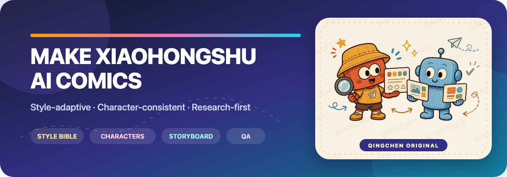
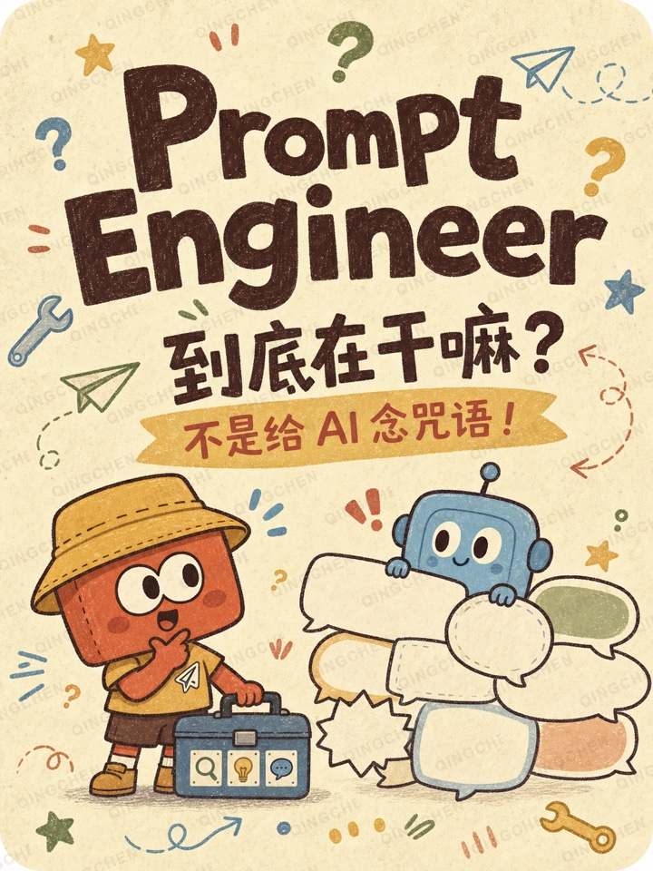

[English](README.md) | **简体中文**

  

  
  
  
  

  <strong>用任意视觉风格，把 AI 概念变成准确、有趣、角色连贯的小红书漫画。</strong>

  资料研究 → 画风圣经 → 角色圣经 → 分镜 → 出图提示词 → 质量检查 → 发布包。

---

## 这是什么？

<strong>Make Xiaohongshu AI Comics</strong> 是一个开源 Codex Skill，用于制作可滑动阅读的 AI 知识漫画。它将流程中最需要思考和校验的部分标准化，同时把视觉方向的选择权留给每一位创作者。

它不会强制使用固定画风、固定配色或内置角色。文档中包含创作者自有的案例作品，但工作流程不会把这些素材用于新项目，也不会进行复制。每个项目都会从用户的提示词或参考图像中重新提炼视觉语言，并将其固化为该项目专属的画风圣经。

## 为什么使用它？

| 能力 | 它保护什么 |
|---|---|
| 🎨 风格自适应工作流 | 不同创作者可以使用水彩、拼贴、像素艺术、编辑插画或自己的参考图 |
| 🧬 角色连贯性 | 反复出现的角色保持轮廓、比例、色彩、配件和教学分工一致 |
| 🔎 研究优先的文案 | 在写漫画文案之前先核对定义、边界、常见误解与局限 |
| 📱 面向小红书的内容结构 | 每张 3:4 页面只讲一个核心观点，滑动节奏清晰，文字简短且适合手机阅读 |
| 🧪 逐页质检 | 检查准确的中文文字、技术术语、视觉偏移和语义限定词 |
| 📦 可重复交付 | 统一管理页面、发布文案、来源、圣经、提示词、草稿和已审核素材 |

## 工作流程

~~~mermaid
flowchart LR
    A["主题 + 受众"] --> B["一手来源研究"]
    B --> C["项目画风圣经"]
    C --> D["原创角色圣经"]
    D --> E["可滑动分镜"]
    E --> F["每页独立出图提示词"]
    F --> G["文字 + 视觉质检"]
    G --> H["发布包"]
~~~

默认故事结构使用八页：

1. 封面与好奇心缺口
2. 可感知的真实痛点
3. 准确定义
4. 机制或实际工作过程
5. 具体对比
6. 评估与局限
7. 常见误解
8. 可执行的收束建议

## 用这套工作流程制作的作品

<table>
  <tr>
    <td width="34%" align="center">
      
    </td>
    <td width="66%" valign="top">
      <h3>Prompt Engineer —— 8 页 AI 科普漫画</h3>
      
这张已完成的封面展示了由创作者自主选择视觉方向的完整流程：

      <ul>
        <li>原创常驻角色：小橙和 AI 小蓝</li>
        <li>适合手机阅读的中文文案和清晰的好奇心缺口</li>
        <li>完整滑动故事中的角色连贯性</li>
        <li>以研究为基础的定义、边界和误解澄清</li>
      </ul>
      
<strong>仅作展示：</strong>该视觉风格和角色属于案例项目。开源 Skill 仍然保持风格自适应，不会将它们作为默认值。

    </td>
  </tr>
</table>

## 快速开始

### 安装

将仓库克隆到 Codex skills 目录：

~~~bash
git clone https://github.com/chenjieliefu/make-xiaohongshu-ai-comics \
  "${CODEX_HOME:-$HOME/.codex}/skills/make-xiaohongshu-ai-comics"
~~~

如果你的环境中可用 Skill 安装器，也可以让 Codex 直接从这个 GitHub 仓库安装。

### 调用

显式提及该 Skill：

~~~text
Use $make-xiaohongshu-ai-comics to turn “RAG” into an 8-page
Xiaohongshu explainer comic for non-technical readers.
Use my attached images only as high-level style references.
~~~

也可以用文字描述视觉方向：

~~~text
Use $make-xiaohongshu-ai-comics to explain AI Agents.
Make the series feel like a calm editorial collage with restrained colors,
paper cutout textures, original characters, and large readable Chinese text.
~~~

## 创建项目文件夹

内置脚本会创建安全、非破坏性的工作目录：

~~~bash
python3 scripts/new_comic_project.py \
  --topic "What is RAG?" \
  --series "AI Field Notes" \
  --output "./episodes/rag"
~~~

它会创建：

~~~text
episodes/rag/
├── brief.md
├── research.md
├── style-bible.md
├── character-bible.md
├── storyboard.md
├── generation-prompts.md
├── publish-caption.md
├── qa-checklist.md
├── pages/
├── drafts/
├── sources/
├── style-references/
└── character-references/
~~~

脚本会拒绝写入非空目录，避免覆盖已有文件。

## 在不复制的前提下适配风格

参考图像只会被视为下列高层属性的来源：

- 媒介与边缘处理
- 配色关系
- 纹理与深度
- 形状语言
- 信息密度和阅读顺序
- 字体排版行为
- 情绪基调

工作流程明确禁止复制参考图中的角色、标志、签名、水印、文字或精确构图。新的主体、版式、道具和常驻角色必须保持原创。

## 准确性规则

该 Skill 旨在保持漫画趣味性的同时，避免把 AI 概念描述成魔法：

- 优先使用官方文档、标准、原始研究和一手技术资料。
- 保留“可以”、“通常”和“对于该任务”等限定词。
- 明确区分提示词、上下文、工具、检索、模型选择、微调和评估。
- 说明某种方法无法独立解决的问题。
- 绝不虚构统计数据、基准测试、薪资、引语或保证性结果。
- 将图像中损坏的文字视为草稿，而不是成品。

## 仓库结构

~~~text
.
├── SKILL.md                         # 核心工作流程和触发说明
├── agents/openai.yaml               # Codex 界面元数据
├── docs/                             # README 横幅和仅作展示的艺术作品
├── references/
│   ├── style-intake.md              # 从文字或图像建立画风圣经
│   ├── character-bible-template.md # 固定常驻角色身份
│   ├── story-architecture.md        # 可滑动教育叙事
│   ├── accuracy-and-copy.md         # 知识与文案护栏
│   ├── image-prompts.md             # 风格中立的提示词骨架
│   └── new-character-protocol.md    # 在不产生视觉漂移的前提下增加角色
└── scripts/new_comic_project.py     # 安全的项目脚手架
~~~

## 贡献

欢迎提交想法、修复、翻译和工作流程改进。在创建 Pull Request 之前，请阅读 [CONTRIBUTING.md](CONTRIBUTING.md)。

推荐的贡献方向：

- 更好的多语言文案质检
- 适用于不同页数的新故事结构
- 更强的角色连贯性检查
- 无障碍和移动端可读性指引
- 保持视觉风格中立的示例

## 许可证

本项目使用 [MIT License](LICENSE) 发布。

---

  <strong>每次滑动一页，让 AI 更容易理解。</strong>

